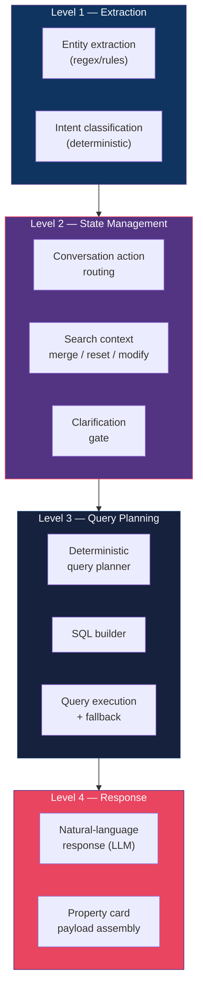
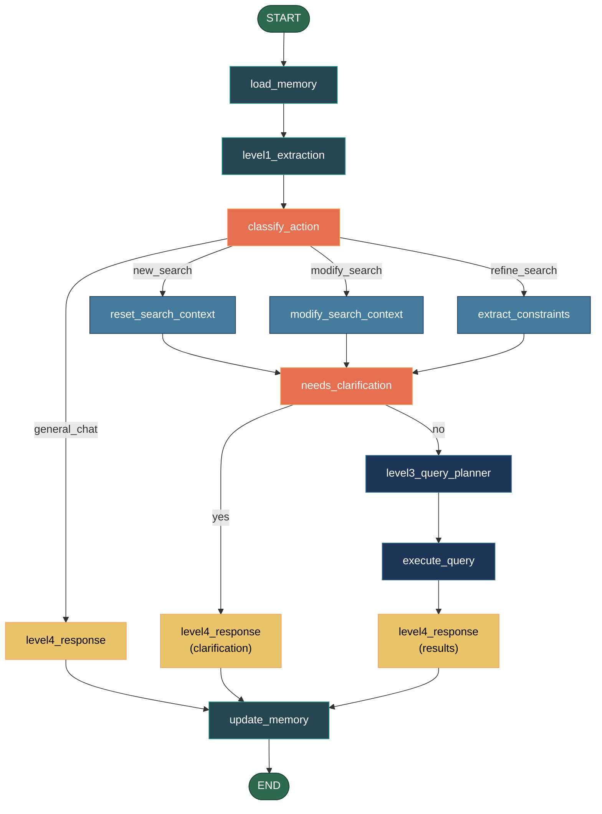
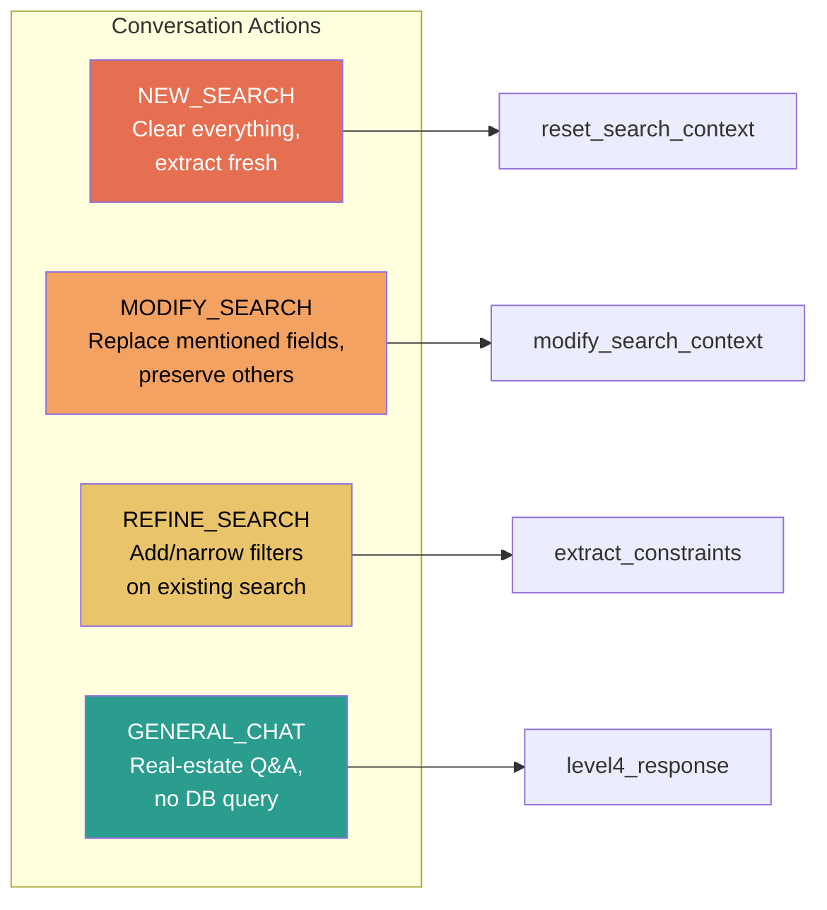
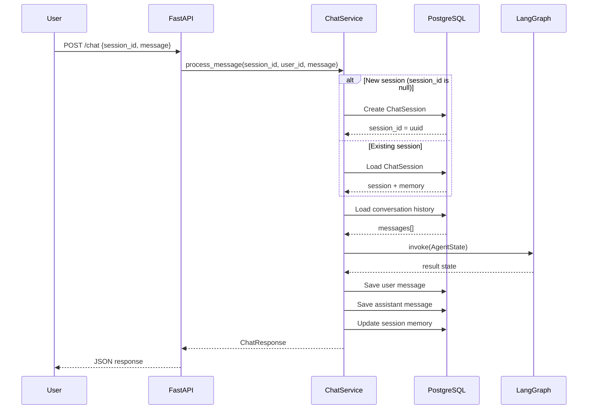

# Chatbot Architecture — NL2SQL Conversational Agent

This document describes the internal architecture of the real-estate chatbot: how a user's natural-language message travels through a multi-node LangGraph pipeline, gets translated into a deterministic SQL query, executes against PostgreSQL, and returns as a conversational response with rich property cards.

---

## Table of Contents

1. [Design Principles](#1-design-principles)
2. [High-Level Data Flow](#2-high-level-data-flow)
3. [The 4-Level Architecture](#3-the-4-level-architecture)
4. [LangGraph State Graph](#4-langgraph-state-graph)
5. [Node-by-Node Deep Dive](#5-node-by-node-deep-dive)
6. [Conversation Action Routing](#6-conversation-action-routing)
7. [Constraint Extraction Pipeline](#7-constraint-extraction-pipeline)
8. [Deterministic SQL Builder](#8-deterministic-sql-builder)
9. [Zero-Result Fallback Strategy](#9-zero-result-fallback-strategy)
10. [Memory & Session Management](#10-memory--session-management)
11. [LLM Boundary](#11-llm-boundary)
12. [SQL Safety & Validation](#12-sql-safety--validation)
13. [Response Generation](#13-response-generation)
14. [State Schema](#14-state-schema)
15. [Search Context Schema](#15-search-context-schema)
16. [API Layer](#16-api-layer)

---

## 1. Design Principles

The chatbot is built on four core design principles:

| Principle | Description |
|-----------|-------------|
| **Determinism first** | Property extraction, action routing, query planning, SQL generation, and property-card data are all rule-based. The same structured search state always produces the same query and the same results, regardless of which LLM is configured. |
| **LLM for presentation only** | The LLM is used *only* for natural-language wording of responses, clarification questions, and general real-estate chat. It never selects which properties to show. |
| **Graceful degradation** | Every LLM call has a deterministic fallback. If the LLM is unreachable or returns garbage, the chatbot continues working with template-based responses. |
| **Provider agnosticism** | Switching between LM Studio, Ollama, OpenAI, Anthropic, or Gemini requires zero code changes — only environment variables (or the admin dashboard). |

---

## 2. High-Level Data Flow

```
User types message in chat UI
          │
          ▼
┌─────────────────────┐
│  Frontend (React)   │  POST /chat { session_id, message }
└────────┬────────────┘
         │
         ▼
┌─────────────────────┐
│  FastAPI endpoint    │  Authenticates user (cookie), creates/loads session
│  /chat               │
└────────┬────────────┘
         │
         ▼
┌─────────────────────┐
│  ChatService         │  Loads session from DB, prepares AgentState,
│                      │  invokes LangGraph, saves results to DB
└────────┬────────────┘
         │
         ▼
┌─────────────────────────────────────────────────────┐
│              LangGraph State Graph                   │
│                                                      │
│  load_memory → level1_extraction → classify_action   │
│       → [route] → extract/modify/reset/general_chat  │
│       → needs_clarification → query_planner           │
│       → execute_query → level4_response               │
│       → update_memory                                │
└────────┬────────────────────────────────────────────┘
         │
         ▼
┌─────────────────────┐
│  ChatResponse        │  { assistant_message, properties[], session_id,
│  (JSON)              │    intent, generated_sql, clarification_*, ... }
└────────┬────────────┘
         │
         ▼
┌─────────────────────┐
│  Frontend renders    │  Chat bubble + up to 5 PropertyCards
│  response            │  + optional "View all" link
└─────────────────────┘
```

---

## 3. The 4-Level Architecture

The agent pipeline is logically divided into four processing levels:



| Level | Nodes | Uses LLM? | Purpose |
|-------|-------|-----------|---------|
| **Level 1** | `level1_extraction` | ❌ No | Extract entities (city, bedrooms, price, etc.) and classify intent from the raw message using regex and pattern matching |
| **Level 2** | `classify_action`, `extract_constraints`, `modify_search_context`, `reset_search_context`, `needs_clarification` | ⚠️ Fallback only | Route the conversation, merge/reset search state, decide if clarification is needed |
| **Level 3** | `level3_query_planner`, `execute_query` | ❌ No | Build query plan JSON, convert to SQL, execute against DB with zero-result fallback |
| **Level 4** | `level4_response` | ✅ Yes | Compose natural-language response using LLM (with deterministic fallback) |

---

## 4. LangGraph State Graph

The agent is a compiled [LangGraph](https://github.com/langchain-ai/langgraph) `StateGraph` with 11 nodes and conditional routing edges.

### Graph Definition



### Routing Logic

Two conditional edges control the graph flow:

**1. `_route_action`** (after `classify_action`):

| Condition | Target Node |
|-----------|-------------|
| `conversation_action == "new_search"` | `reset_search_context` |
| `conversation_action == "modify_search"` | `modify_search_context` |
| `conversation_action == "general_chat"` | `level4_response` (skip query entirely) |
| All other actions (refine, etc.) | `extract_constraints` |

**2. `_route_clarification`** (after `needs_clarification`):

| Condition | Target Node |
|-----------|-------------|
| `clarification_needed == True` | `level4_response` (ask the user a question) |
| `clarification_needed == False` | `level3_query_planner` (proceed to query) |

---

## 5. Node-by-Node Deep Dive

### 5.1 `load_memory`

**File**: `nodes/load_memory.py`
**LLM**: ❌ None
**Purpose**: First node in the graph. Deserialises the session's persisted memory (from PostgreSQL) into a structured `SearchContext` and `ActiveSearchSession`.

**What it does**:
1. Reads the raw `memory` dict from state (loaded from DB by `ChatService`)
2. Handles migration from old flat format (`city`, `intent`, `bedrooms`, ...) to new nested format (`search_context: { ... }`)
3. Restores or derives `active_search` — if the session predates T22, derives it from `search_context` with a fresh UUID
4. Returns `search_context`, `memory`, and `active_search` to state

---

### 5.2 `level1_extraction`

**File**: `nodes/level1_extraction.py`
**LLM**: ❌ None (fully deterministic)
**Purpose**: Extracts entities and classifies intent using regex patterns and keyword rules.

**Entity extraction**:
- **City** — matches against known cities in the inventory
- **Neighbourhood** — cross-referenced against a live DB query (`SELECT DISTINCT neighbourhood, city FROM properties`)
- **Property type** — `apartment`, `house` (including synonyms: flat, home)
- **Bedrooms/Bathrooms** — numeric patterns like `3 bed`, `2br`, `3-bedroom`
- **Price** — supports `under $500k`, `budget 2000`, `between 1k and 2k`, `around 1500`
- **Radius** — `within 5km`, `10km from centre`
- **Sort hints** — `cheapest`, `largest`, `closest to city centre`

**Intent classification** (priority order):
1. `comparison` — "compare", "versus", "vs"
2. `count` — "how many", "count of"
3. `aggregation` — "average", "minimum price", "maximum price"
4. `ranking` — "cheapest", "largest", "top 5"
5. `radius_search` — presence of km distance pattern
6. `general_chat` — "what is", "explain", "should I" (without search verbs)
7. `property_search` — property words or search verbs detected
8. `modify_search` — "switch to", "change city", "rent instead"

---

### 5.3 `classify_action`

**File**: `nodes/classify_action.py`
**LLM**: ⚠️ Hybrid (deterministic-first, LLM fallback for ambiguous turns)
**Purpose**: Routes the conversation to the appropriate downstream path.

**Decision cascade**:

```
User message
    │
    ├─ "start over" / "new search" / "fresh start" / "forget everything"
    │   → NEW_SEARCH
    │
    ├─ Per-field forget ("forget the budget", "no bedroom limit")
    │   + active search exists
    │   → MODIFY_SEARCH (with clear_fields)
    │
    ├─ Switch language ("switch to Berlin", "rent instead")
    │   → MODIFY_SEARCH (if active search) or NEW_SEARCH
    │
    ├─ Search keywords or new constraints detected
    │   → REFINE_SEARCH (if active search) or NEW_SEARCH
    │
    ├─ General question ("what is", "explain", "should I")
    │   → GENERAL_CHAT
    │
    └─ Ambiguous turn with active search
        → LLM interprets action (hybrid fallback)
        → Falls back to GENERAL_CHAT if LLM unavailable
```

**LLM fallback** (only triggered when rules are uncertain *and* an active search exists):
- Sends the last 6 conversation turns + current search state to the LLM
- LLM returns JSON: `{"action": "refine_search|modify_search|new_search|forget|general_chat", "clear": [...]}`
- If LLM fails or returns invalid JSON, defaults to `GENERAL_CHAT`

**Per-field forgetting**:
The classifier detects natural language like:
- "forget the budget" → clears `budget`, `min_budget`
- "no bedroom limit" → clears `bedrooms`
- "any price" / "price doesn't matter" → clears `budget`, `min_budget`
- "ignore the city" → clears `city`, `neighbourhood`

---

### 5.4 `extract_constraints`

**File**: `nodes/extract_constraints.py`
**LLM**: ⚠️ Fallback only (when regex finds ≤ 1 constraint)
**Purpose**: Default path for REFINE_SEARCH. Extracts structured constraints and merges them into the existing `SearchContext`.

**Two-tier extraction**:

```
User message
    │
    ▼
┌──────────────────┐
│  Regex fast-path  │  Pattern matching for city, price, bedrooms, etc.
└────────┬─────────┘
         │
         ▼
   Found > 1 constraint?
    │           │
   YES          NO
    │           │
    ▼           ▼
  Skip LLM   ┌──────────────────┐
              │  LLM extraction   │  Prompt: extract JSON from message
              └────────┬─────────┘
                       │
                       ▼
              Merge LLM results into regex results
              (LLM fills gaps, regex takes precedence)
    │           │
    └─────┬─────┘
          ▼
┌──────────────────┐
│  Normalize        │  Validate values, map aliases (max_price→budget)
└────────┬─────────┘
         ▼
┌──────────────────┐
│  Merge into       │  Updated SearchContext preserves unchanged fields
│  SearchContext     │
└──────────────────┘
```

**Normalization rules**:
- City names → proper case (`berlin` → `Berlin`)
- `intent` → mapped to `rent_or_buy`
- `max_price` → mapped to `budget`
- Price values with `k` suffix → multiplied by 1,000
- Only whitelisted sort fields accepted: `price`, `size_sqm`, `bedrooms`, `distance_from_city_km`

---

### 5.5 `modify_search_context`

**File**: `nodes/modify_search_context.py`
**LLM**: ❌ None (regex-only extraction)
**Purpose**: Handles MODIFY_SEARCH — replaces *only* the fields the user explicitly mentioned, preserving everything else.

**Key invariant**: Each `SearchContext` slot holds exactly one value. Only the latest value survives. The `search_id` is **preserved** across MODIFY_SEARCH turns (same logical search, different filters).

**Process**:
1. Extract constraints using regex-only (no LLM) from the user message
2. Filter to replaceable fields only (city, intent, property_type, bedrooms, bathrooms, budget, radius_km, sort_by, sort_order, limit)
3. Merge replacements into the existing `SearchContext`
4. Apply any `clear_fields` from the classifier (per-field forgets set fields to `None`)

---

### 5.6 `reset_search_context`

**File**: `nodes/reset_search_context.py`
**LLM**: ⚠️ Used via `apply_new_search` for complex extraction
**Purpose**: Handles NEW_SEARCH — discards all previous search filters and starts fresh.

**Process**:
1. Discards the entire previous `SearchContext`
2. Extracts constraints fresh from the current message (via `apply_new_search`)
3. Returns a clean `SearchContext` with only newly extracted constraints
4. Generates a **fresh `search_id`** (new UUID) — signals a completely new search to the system

**What's preserved**: Session metadata (session_id, conversation history) is NOT touched — only search filters are cleared.

---

### 5.7 `needs_clarification`

**File**: `nodes/needs_clarification.py`
**LLM**: ❌ None (fully deterministic rules)
**Purpose**: Gatekeeper that decides whether to proceed to query execution or ask the user for more information.

**Rule cascade** (evaluated in order):

| Rule | Condition | Result |
|------|-----------|--------|
| -1 | User explicitly modified an existing search (`intent == "modify_search"`) | **Never clarify** |
| 0 | Upstream already flagged clarification | **Clarify** (honour upstream) |
| 0b | Intent is `clarification` | **Clarify** |
| 1 | Intent is `clarification_needed` | **Clarify** |
| 2 | Intent is `unsupported` | **Don't clarify** (let error handler deal with it) |
| 2.5 | Intent is `pattern_search`, `aggregation`, `comparison`, or `count` | **Don't clarify** (structured queries proceed directly) |
| 3 | Ranking words present ("cheapest", "largest", "closest", etc.) | **Never clarify** |
| 4 | City-required intent but no city AND no strong filters | **Clarify**: "Which city?" |
| 5 | Radius search without radius value | **Clarify**: "How far?" |
| 6 | Vague words ("affordable", "cheap", "nice place") without concrete filters | **Clarify** |
| 7 | No meaningful constraints at all + vague intent | **Clarify**: "Which city? Buy or rent?" |
| default | — | **Proceed** |

**Strong filters** (bypass clarification if any is present): `bedrooms`, `bathrooms`, `budget`, `radius_km`, `ranking_type`

**Question generation priority**: city → rent/buy → budget → property type → bedrooms

---

### 5.8 `level3_query_planner`

**File**: `nodes/level3_query_planner.py`
**LLM**: ❌ None (fully deterministic)
**Purpose**: Converts the classified intent and search context into a structured query plan JSON.

**Query plan types**:

| Intent | Query Plan | Key Fields |
|--------|-----------|------------|
| `count` | `{"query_type": "count"}` | — |
| `aggregation` | `{"query_type": "aggregation", "aggregation": "average_price\|min_price\|max_price"}` | Scans user message for "maximum", "minimum", etc. |
| `comparison` | `{"query_type": "comparison"}` | — |
| `radius_search` | `{"query_type": "radius", "max_distance_km": N}` | From `search_context.radius_km` |
| `ranking` or sort present | `{"query_type": "ranking", "sort_field": "price", "sort_direction": "asc", "limit": 5}` | Derives sort from ranking_type keywords |
| Pattern search | `{"query_type": "pattern", "field": "description", "term": "..."}` | `search_context.search_term` |
| Default | `{"query_type": "listing", "limit": 20}` | Capped at 50 |

---

### 5.9 `execute_query`

**File**: `nodes/execute_query.py`
**LLM**: ❌ None
**Purpose**: Converts the query plan + search context into SQL via the deterministic builder, executes it against PostgreSQL, and applies the zero-result fallback strategy if needed.

**Process**:
1. Call `build_sql(plan, context)` → `(sql_string, bind_params)`
2. Execute against PostgreSQL via async SQLAlchemy engine
3. If results exist or query type is count/aggregation/comparison → return immediately
4. If zero results → trigger [fallback strategy](#9-zero-result-fallback-strategy)

---

### 5.10 `level4_response`

**File**: `nodes/level4_response.py`
**LLM**: ✅ Yes (with deterministic fallback)
**Purpose**: Final node before memory update. Composes the natural-language response.

See [§13 Response Generation](#13-response-generation) for full details.

---

### 5.11 `update_memory`

**File**: `nodes/update_memory.py`
**LLM**: ❌ None
**Purpose**: Persists the updated search state back to the session memory for the next turn.

**Persisted state**:
- `search_context` — current merged search filters
- `previous_context` — snapshot of the pre-turn search context (for debugging)
- `active_search` — canonical search object with `search_id`
- `last_sql` — the generated SQL (for developer mode)
- `last_result_count` — how many rows the query returned
- `last_intent` — the classified intent

---

## 6. Conversation Action Routing

The conversation supports four primary actions:



### Search Context Lifecycle

```
Turn 1: "Find apartments in Berlin"
  → NEW_SEARCH → search_id=uuid-A
  → context: {city: Berlin, property_type: apartment}

Turn 2: "Under 500k"
  → REFINE_SEARCH → search_id=uuid-A (preserved)
  → context: {city: Berlin, property_type: apartment, budget: 500000}

Turn 3: "Switch to Paris"
  → MODIFY_SEARCH → search_id=uuid-A (preserved)
  → context: {city: Paris, property_type: apartment, budget: 500000}

Turn 4: "Forget the budget"
  → MODIFY_SEARCH → search_id=uuid-A (preserved)
  → context: {city: Paris, property_type: apartment, budget: null}

Turn 5: "Start over. Show houses in Rome"
  → NEW_SEARCH → search_id=uuid-B (new UUID)
  → context: {city: Rome, property_type: house}
```

---

## 7. Constraint Extraction Pipeline

### Regex Patterns

| Constraint | Pattern Examples | Regex |
|-----------|------------------|-------|
| **City** | "in Berlin", "Berlin apartments" | Exact match against `{London, Paris, Berlin, Amsterdam, Rome}` |
| **Neighbourhood** | "in Kreuzberg" | Cross-referenced with live DB query |
| **Property type** | "apartment", "flat", "house", "home" | Word boundary match |
| **Bedrooms** | "3 bed", "3-bedroom", "3br" | `(\d+)\s*[-\s]?(?:bed(?:room)?s?\|br)` |
| **Bathrooms** | "2 bath", "2-bathroom" | `(\d+)\s*[-\s]?(?:bath(?:room)?s?\|ba)` |
| **Max price** | "under $500k", "budget 2000", "max 300k" | `(?:under\|below\|max\|budget)\s*[£€$]?\s*(\d+)\s*k?` |
| **Price range** | "between 1k and 2k", "from 200 to 500" | `(?:between\|from)\s*...\s*(?:and\|to)` |
| **Approx price** | "around 1500", "about 2k" | `(?:around\|about\|roughly)\s*[£€$]?\s*(\d+)` |
| **Radius** | "within 5km", "10km" | `(\d+(?:\.\d+)?)\s*km` |
| **Limit** | "top 3", "show 10" | `(?:top\|first)\s*(\d+)` |
| **Sort** | "cheapest", "largest", "closest" | Keyword match → sort_field + direction |

### Normalisation

```
Raw extraction          →    Normalised SearchContext field
─────────────────────────────────────────────────────────
"berlin"                →    city = "Berlin"
intent = "rent"         →    rent_or_buy = "rent"
max_price = 500         →    budget = 500000  (k-detection)
"apartment"             →    property_type = "apartment"
"3"  (from "3-bed")     →    bedrooms = 3
```

---

## 8. Deterministic SQL Builder

**File**: `deterministic_builder.py`

The SQL builder takes a Level 3 query plan and a search context and produces a parameterised SQL query. **No LLM is involved**.

### Query Construction

```sql
-- Base
SELECT * FROM properties WHERE 1=1

-- Filters (applied conditionally based on SearchContext)
  AND city ILIKE :city                        -- if city is set
  AND neighbourhood ILIKE :neighbourhood      -- if neighbourhood is set
  AND property_type = :property_type          -- if property_type is set
  AND intent = :intent                        -- if rent_or_buy is set
  AND bedrooms = :bedrooms                    -- if bedrooms is set
  AND bathrooms = :bathrooms                  -- if bathrooms is set
  AND price >= :min_budget                    -- if min_budget is set
  AND price <= :budget                        -- if budget is set
  AND distance_from_city_km <= :radius        -- if radius_km is set

-- Query-type specific
  ORDER BY price ASC                          -- ranking/sort
  LIMIT 20                                    -- capped at 50
```

### Special Query Types

| Type | SELECT clause | GROUP BY | Notes |
|------|--------------|----------|-------|
| **count** | `SELECT COUNT(*) as result_count` | — | No ordering or limit |
| **aggregation** | `SELECT ROUND(AVG(price)) as result_value` | — | Also supports `MIN(price)`, `MAX(price)` |
| **comparison** | `SELECT city, ROUND(AVG(price)), COUNT(*)` | `GROUP BY city` | City filter skipped; optional `WHERE city = ANY(:cities)` |
| **ranking** | `SELECT *` | — | `ORDER BY {sort_field} {direction} LIMIT {n}` |
| **radius** | `SELECT *` | — | Extra `AND distance_from_city_km <= :plan_radius` |
| **pattern** | `SELECT *` | — | `AND {field} ILIKE '%{term}%'` |
| **listing** | `SELECT *` | — | Default `LIMIT 20` |

### Safety: Parameterised Queries

All user-derived values are passed as bind parameters (`:city`, `:budget`, etc.), never interpolated into the SQL string. This prevents SQL injection by design.

---

## 9. Zero-Result Fallback Strategy

When the initial query returns zero rows, the system automatically attempts to relax constraints one at a time:

```
Original query returns 0 results
    │
    ▼
Try relaxing (in order):
    │
    ├─ 1. Radius    → multiply by 1.5x
    ├─ 2. Budget    → increase by 20%
    ├─ 3. Min budget → decrease by 20%
    ├─ 4. Bedrooms  → reduce by 1 (skip if already ≤ 1)
    └─ 5. Property type → remove filter entirely
    │
    ▼
First relaxation that produces results → STOP
    │
    ├─ Results found:
    │   Return results + fallback_applied=true
    │   + fallback_message="No exact matches, so I widened
    │     the search using a wider radius."
    │
    └─ No results after all relaxations:
        Return empty + original message
```

**Key constraint**: The fallback **never** invents properties or changes the search silently. The response explicitly reports which constraint was relaxed.

---

## 10. Memory & Session Management

### Session Lifecycle



### Memory Structure (`SessionMemory`)

```json
{
  "search_context": {
    "city": "Berlin",
    "rent_or_buy": "rent",
    "property_type": "apartment",
    "bedrooms": 3,
    "budget": 500000,
    "...": "..."
  },
  "previous_context": { "...": "snapshot of pre-turn state" },
  "active_search": {
    "search_id": "uuid-...",
    "city": "Berlin",
    "...": "mirrors search_context"
  },
  "last_sql": "SELECT * FROM properties WHERE ...",
  "last_result_count": 12,
  "last_intent": "property_search"
}
```

---

## 11. LLM Boundary

The table below clarifies exactly where the LLM is used and where it is not:

| Component | LLM Used? | Details |
|-----------|-----------|---------|
| Entity extraction (Level 1) | ❌ | Regex + keyword rules |
| Intent classification (Level 1) | ❌ | Regex + keyword rules |
| Conversation action routing | ⚠️ Hybrid | Deterministic rules first; LLM fallback only for ambiguous turns with active search |
| Constraint extraction (Level 2) | ⚠️ Fallback | Regex fast-path first; LLM only when regex finds ≤ 1 constraint |
| Clarification gate | ❌ | Deterministic rule cascade |
| Query planning (Level 3) | ❌ | Deterministic mapping from intent → plan |
| SQL generation | ❌ | Deterministic builder with parameterised queries |
| Query execution | ❌ | Direct async PostgreSQL execution |
| Zero-result fallback | ❌ | Deterministic constraint relaxation |
| Response wording (Level 4) | ✅ | LLM phrases the response naturally |
| Clarification question phrasing | ✅ | LLM rephrases the deterministic question |
| General real-estate chat | ✅ | LLM generates the full answer |
| Count/aggregation/comparison | ✅ | LLM rephrases the exact factual answer (numbers are validated) |

### Number Safety in Factual Responses

When the LLM rephrases count/aggregation answers, a `must_contain` guard ensures the exact number survives:

```python
# If the LLM drops or changes "18" from "I found 18 properties", 
# the system reverts to the deterministic template.
msg = await _natural_fact(llm, state, ctx, answer, must_contain="18")
if "18" not in msg:
    return answer  # Revert to exact deterministic wording
```

---

## 12. SQL Safety & Validation

**File**: `utils.py`

Even though the current pipeline uses the deterministic SQL builder (not LLM-generated SQL), the system includes comprehensive SQL validation as defence-in-depth:

| Check | Description |
|-------|-------------|
| **Statement type** | Only `SELECT` allowed — blocks `INSERT`, `UPDATE`, `DELETE`, `DROP`, `ALTER`, `CREATE`, `TRUNCATE`, `MERGE`, `EXECUTE`, `CALL`, `GRANT`, `REVOKE`, `COPY` |
| **UNION** | Blocked — prevents exfiltration via UNION injection |
| **System catalogs** | `information_schema`, `pg_catalog`, `pg_stat` blocked |
| **Multiple statements** | Mid-query semicolons blocked |
| **SQL comments** | `--` and `/* */` blocked |
| **Table whitelist** | Only `properties` and `city_centers` allowed |
| **Column whitelist** | Schema-aware validation against known columns |
| **Hallucinated columns** | Explicit blocklist of commonly hallucinated columns (`school_distance`, `amenities`, `pool`, etc.) |
| **Parameterised queries** | All user values passed as bind params, never string-interpolated |

---

## 13. Response Generation

The `level4_response` node handles five distinct response scenarios:

### Response Routing

```
                  ┌─ clarification_needed?  → Ask ONE natural follow-up question
                  │
                  ├─ sql_error?             → "I ran into a problem..."
                  │
AgentState  ──────├─ general_chat?          → Full LLM response (real-estate scoped)
                  │
                  ├─ count/aggregation/     → Deterministic factual answer,
                  │  comparison?               LLM-rephrased with number guard
                  │
                  └─ listing/ranking/       → LLM-phrased summary sentence
                     radius/pattern?           + up to 5 property card dicts
```

### Deterministic Fallbacks

Every LLM call wraps `_llm_text()`, which catches any exception and returns the pre-computed deterministic text:

```python
async def _llm_text(llm, system, user, fallback) -> str:
    try:
        out = (await llm.invoke([...])).strip()
        return out or fallback
    except Exception:
        return fallback  # Always works, even with no LLM
```

### Property Card Assembly

Results are **deterministic** — the same filters always produce the same rows. The response includes:
- Up to 5 property dicts (top results from the query)
- Each property includes `property_url` (`/properties/{id}`) and derived `currency`
- If `result_count > 5`, a `more_results_url` is included for the "View all" link

---

## 14. State Schema

The `AgentState` is a `TypedDict` that flows through every node:

```python
class AgentState(TypedDict, total=False):
    # ── Input ──
    session_id: str
    user_id: str
    user_message: str
    
    # ── Memory ──
    memory: dict                      # Persisted session memory
    history: list[dict]               # Recent conversation messages
    
    # ── Level 1 ──
    intent: str                       # Classified intent
    level1_entities: dict             # Extracted entities
    
    # ── Level 2 ──
    conversation_action: str          # new_search | modify_search | refine_search | general_chat
    search_context: dict              # Merged search filters
    active_search: dict               # Canonical search object with search_id
    constraints: dict                 # Newly extracted constraints
    clear_fields: list[str]           # Fields to null out (per-field forget)
    
    # ── Clarification ──
    clarification_needed: bool
    clarification_question: str
    
    # ── Level 3 ──
    query_plan: dict                  # Level 3 query plan JSON
    generated_sql: str                # The built SQL string
    sql_valid: bool
    sql_error: str
    
    # ── Execution ──
    query_results: list[dict]         # Raw DB rows
    result_count: int
    retry_count: int
    
    # ── Level 4 ──
    assistant_message: str            # Final natural-language response
    properties: list[dict]            # Property cards (up to 5)
    error_message: str
    
    # ── Fallback ──
    fallback_applied: bool
    fallback_message: str
```

---

## 15. Search Context Schema

The `SearchContext` Pydantic model represents the accumulated search state across turns:

| Field | Type | Source | Description |
|-------|------|--------|-------------|
| `city` | `str?` | Extraction | Target city (London, Paris, Berlin, Amsterdam, Rome) |
| `neighbourhood` | `str?` | Extraction | Target neighbourhood within city |
| `property_type` | `str?` | Extraction | `apartment` or `house` |
| `bedrooms` | `int?` | Extraction | Exact bedroom count |
| `bathrooms` | `int?` | Extraction | Exact bathroom count |
| `budget` | `float?` | Extraction | Maximum price (aliases: `max_price`) |
| `min_budget` | `float?` | Extraction | Minimum price |
| `rent_or_buy` | `str?` | Extraction | `rent` or `buy` |
| `ranking_type` | `str?` | Extraction | e.g. "cheapest", "largest" |
| `radius_km` | `float?` | Extraction | Distance from city centre |
| `search_term` | `str?` | Extraction | Free-text pattern search |
| `sort_by` | `str?` | Extraction | Sort column (price, size_sqm, etc.) |
| `sort_order` | `str?` | Extraction | `asc` or `desc` |
| `limit` | `int?` | Extraction | Max results to return |
| `cities` | `list[str]?` | Extraction | Multi-city comparison list |
| `aggregation` | `str?` | Extraction | Aggregation function type |

### Merge Semantics

```
Existing context: {city: "Berlin", bedrooms: 3, budget: 500000}
New constraints:  {budget: 300000}

Merged result:    {city: "Berlin", bedrooms: 3, budget: 300000}
                   ↑ preserved      ↑ preserved    ↑ replaced
```

- Only non-null new values replace existing ones
- Unmentioned fields are preserved across turns
- A NEW_SEARCH discards the entire context first

---

## 16. API Layer

### Endpoint

```
POST /chat
Content-Type: application/json
Cookie: re_session=<session_token>

{
  "session_id": "uuid-or-null",
  "message": "Find 3-bedroom apartments in Berlin under 500k"
}
```

### Response

```json
{
  "session_id": "abc-123",
  "user_message": "Find 3-bedroom apartments in Berlin under 500k",
  "assistant_message": "I found 12 apartments in Berlin matching your criteria. Would you like to see only rentals or properties for sale?",
  "intent": "property_search",
  "generated_sql": "SELECT * FROM properties WHERE city ILIKE 'Berlin' AND ...",
  "properties": [
    {
      "id": 42,
      "title": "Modern 3BR Apartment in Mitte",
      "city": "Berlin",
      "neighbourhood": "Mitte",
      "intent": "buy",
      "price": 450000,
      "bedrooms": 3,
      "bathrooms": 2,
      "size_sqm": 95,
      "property_type": "apartment",
      "distance_from_city_km": 2.3,
      "description": "...",
      "property_url": "/properties/42",
      "currency": "USD"
    }
  ],
  "clarification_needed": false,
  "result_count": 12,
  "fallback_applied": false,
  "more_results_url": "/properties?city=Berlin&bedrooms=3&max_price=500000"
}
```

### Supporting Endpoints

| Method | Endpoint | Description |
|--------|----------|-------------|
| `GET` | `/chat/sessions` | List user's chat sessions |
| `GET` | `/chat/sessions/{id}/messages` | Get messages for a session |
| `DELETE` | `/chat/sessions/{id}` | Delete a chat session |
